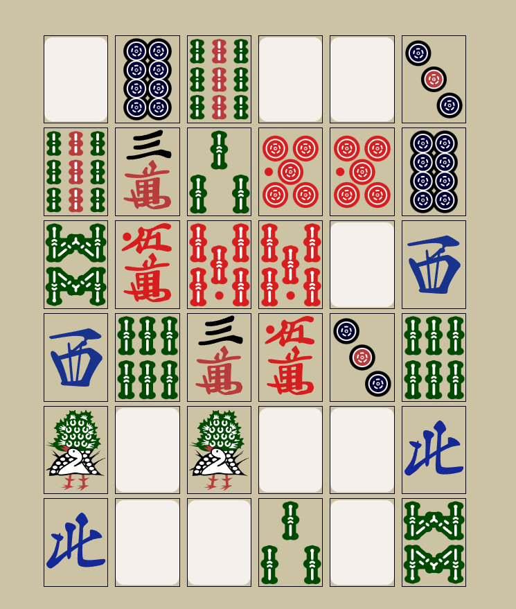

# Mahjong Game Using React

This is a simple Memory-Based game where card are kept flipped and the user has to find the matching cards one by one. The maximum number of cards that can remain front facing at any time is no more than 2

# Preview

